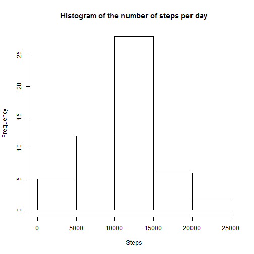
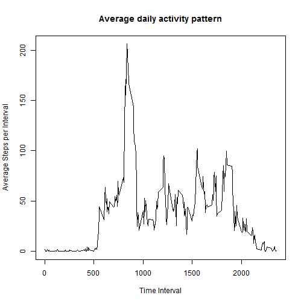
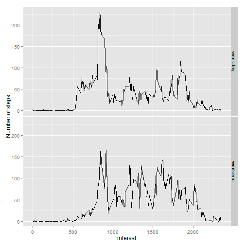

## Loading and preprocessing the data

First we have to load the data from the url into the working directory.

```r
if(!file.exists("activity.zip")){
        
        file.url <- "https://d396qusza40orc.cloudfront.net/repdata%2Fdata%2Factivity.zip"
        
        download.file(file.url, "activity.zip")
}


if(!file.exists("amd"))
        unzip("activity.zip", exdir="amd")
```

Read the raw data into R and carry out some preprocessing


```r
amd <- read.csv("amd/activity.csv")

amd$date <- as.Date(amd$date)
```


## What is mean total number of steps taken per day?

Aggregate the steps by date into a new dataset.

1. Make a histogram of the total number of steps taken each day

```r
daily.steps <- aggregate(steps ~ date, sum, data=amd)

hist(daily.steps$steps, main='Histogram of the number of steps per day', xlab='Steps')
```

 

2. Calculate and report the mean and median total number of steps taken per day


```r
mean(daily.steps$steps)
```

```
## [1] 10766
```

```r
median(daily.steps$steps)
```

```
## [1] 10765
```

## What is the average daily activity pattern?


1. Make a time series plot (i.e. type = "l") of the 5-minute interval (x-axis) and the average number of steps taken, averaged across all days (y-axis)


```r
steps.avg <- aggregate(steps ~ interval, mean, data=amd)

plot(steps.avg$interval, steps.avg$steps, type="l",main="Average daily activity pattern" , xlab="Time Interval", ylab="Average Steps per Interval")
```

 

2. Which 5-minute interval, on average across all the days in the dataset, contains the maximum number of steps?


```r
steps.avg[steps.avg$steps == max(steps.avg$steps),1]
```

```
## [1] 835
```


## Imputing missing values

1. Calculate and report the total number of missing values in the dataset (i.e. the total number of rows with NAs).


```r
sum(is.na(amd$steps))
```

```
## [1] 2304
```

2. Devise a strategy for filling in all of the missing values in the dataset. The strategy does not need to be sophisticated. For example, you could use the mean/median for that day, or the mean for that 5-minute interval, etc.

- The strategy employed is to use the mean value calculated earlier to replace the NA values.


3. Create a new dataset that is equal to the original dataset but with the missing data filled in.


```r
amd.na <- merge(amd, steps.avg, "interval")

amd.na[is.na(amd.na$steps.x), "steps.x"] <- amd.na$steps.y[is.na(amd.na$steps.x)]
```

4. Make a histogram of the total number of steps taken each day and Calculate and report the mean and median total number of steps taken per day. Do these values differ from the estimates from the first part of the assignment? What is the impact of imputing missing data on the estimates of the total daily number of steps?


```r
daily.steps.2 <- aggregate(steps.x ~ date, sum, data=amd.na)

hist(daily.steps.2$steps.x, main = "Number of steps per day", xlab = "Steps")
```

 

```r
mean(daily.steps.2$steps.x)
```

```
## [1] 10766
```

```r
median(daily.steps.2$steps.x)
```

```
## [1] 10766
```

- As can be seen, after imputing the missiing data, the mean has not changed but the median has (slightly).

## Are there differences in activity patterns between weekdays and weekends?

1. Create a new factor variable in the dataset with two levels - "weekday" and "weekend" indicating whether a given date is a weekday or weekend day.


```r
amd.na[!(weekdays(amd.na$date) %in% c('Saturday','Sunday')),"week"] <- "weekday"  
amd.na[(weekdays(amd.na$date) %in% c('Saturday','Sunday')),"week"] <- "weekend"  
amd.na$week <- as.factor(amd.na$week)
```

2. Make a panel plot containing a time series plot (i.e. type = "l") of the 5-minute interval (x-axis) and the average number of steps taken, averaged across all weekday days or weekend days (y-axis).


```r
require(ggplot2)
```

```
## Loading required package: ggplot2
## Need help? Try the ggplot2 mailing list: http://groups.google.com/group/ggplot2.
```

```r
week.steps <- aggregate(steps.x ~ week + interval, data=amd.na, mean)

qplot(interval, steps.x, data=week.steps, facets= week ~ .  , geom="line", ylab="Number of steps")
```

 

